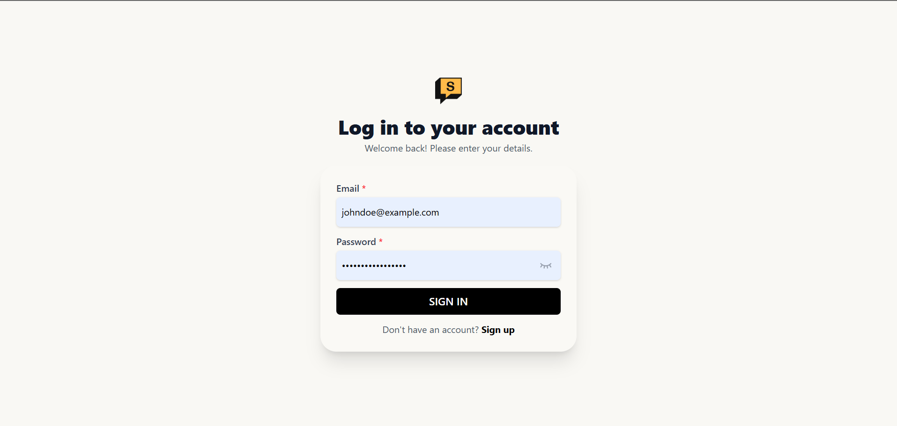
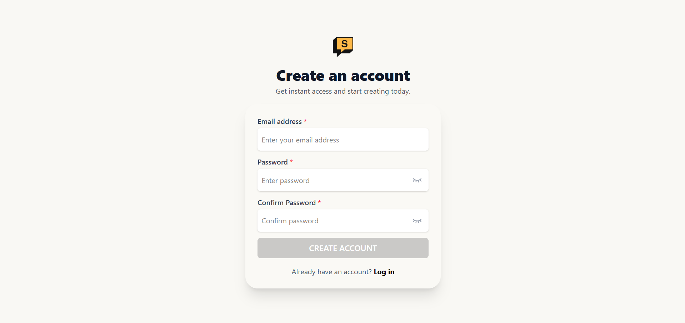
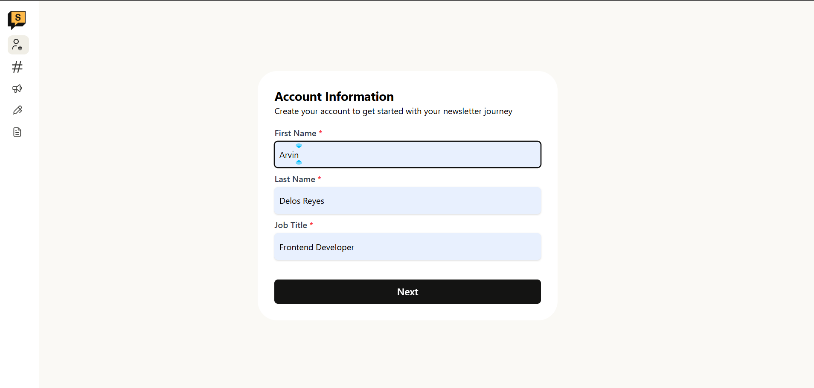
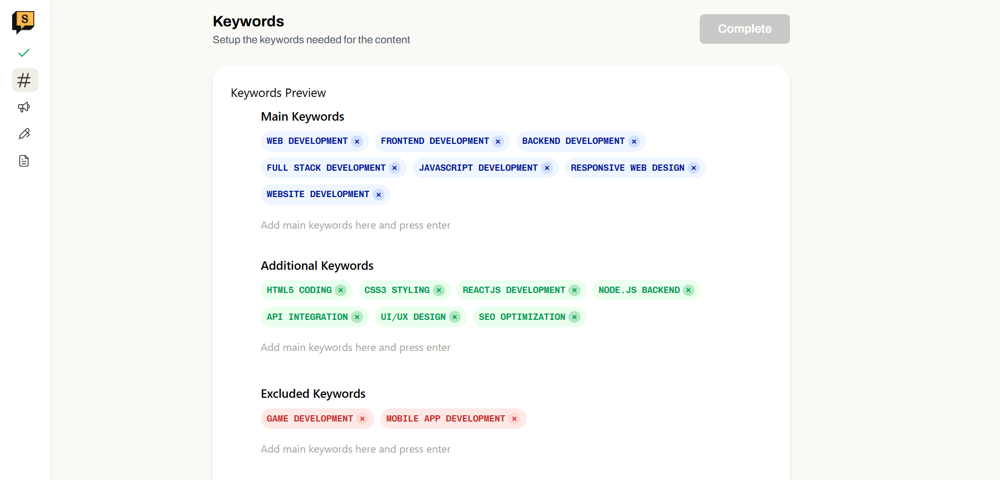
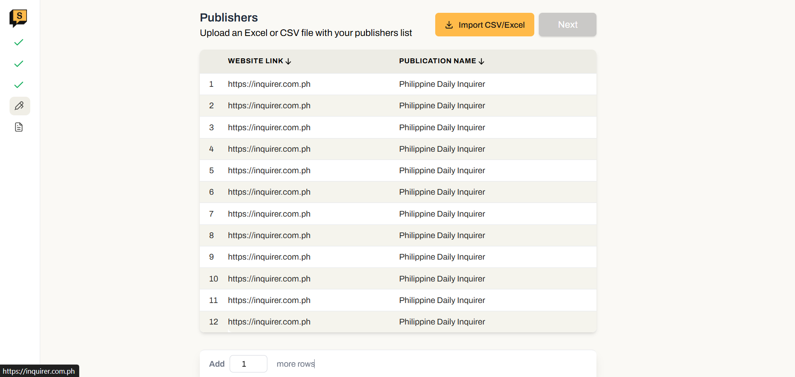
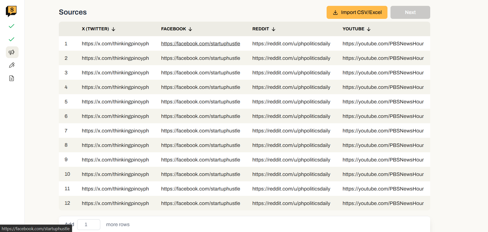
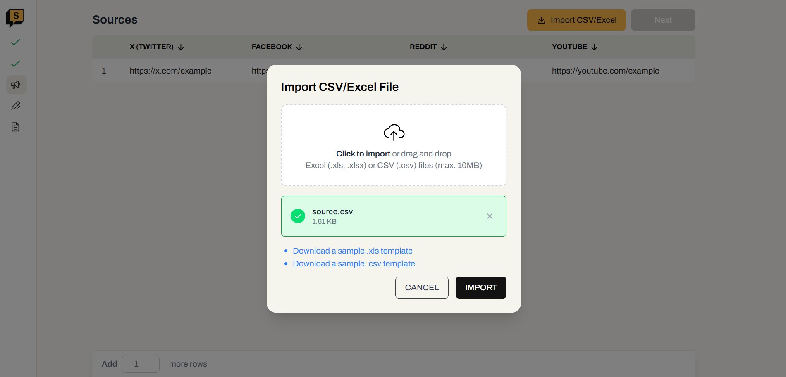
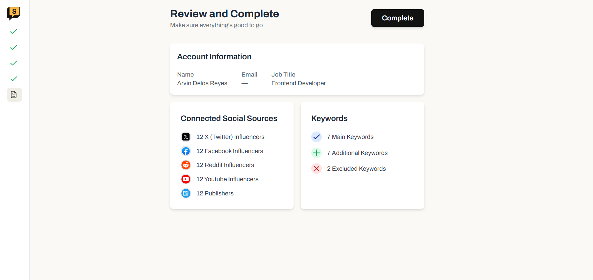

# Scoup Staging Media Meter

This is a React-based frontend application for managing media sources, publishers, and onboarding users. Built with Vite, Tailwind CSS, and modern React best practices.

## Screenshots

### Authentication




### Onboarding Flow









### Dashboard


## Features

- User onboarding flow with multiple steps
- Dashboard for managing publishers and social sources
- Keyword tagging and input
- Modal dialogs for uploads and reviews
- Responsive UI with custom components
- Sidebar navigation and layouts

## Tech Stack

- React
- Vite
- Tailwind CSS
- Tabler Icons
- Custom hooks and components

## Getting Started

### Prerequisites

- Node.js (v16 or higher recommended)
- npm

### Installation

1. Clone the repository:
   ```sh
   git clone https://github.com/arvndlr/scoup-staging-media-meter.git
   cd scoup-staging-media-meter/frontend-exam
   ```
2. Install dependencies:
   ```sh
   npm install
   ```

### Running the App

Start the development server:

```sh
npm run dev
```

The app will be available at `http://localhost:5173` (default Vite port).

### Building for Production

```sh
npm run build
```

### Linting

```sh
npm run lint
```

## Project Structure

```
frontend-exam/
├── public/           # Static assets
├── src/
│   ├── components/   # Reusable UI components
│   ├── pages/        # Page components (Dashboard, Onboarding, etc.)
│   ├── db/           # Local database (db.json)
│   ├── styles/       # Tailwind CSS config
│   └── utils/        # Utility functions
├── package.json
├── vite.config.js
└── README.md
```

## Contributing

Pull requests are welcome! For major changes, please open an issue first to discuss what you would like to change.

## License

MIT
